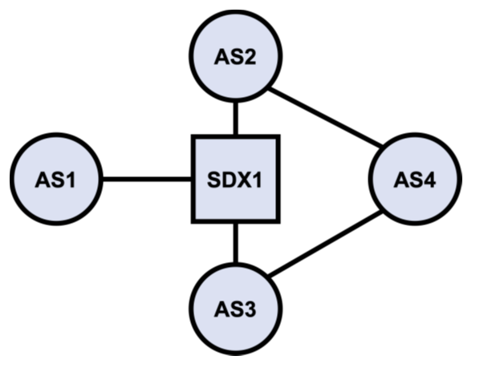
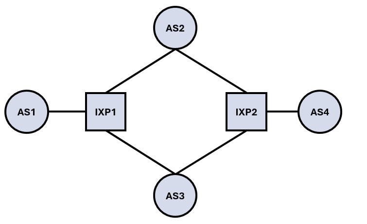

# CS6204-Project

Course project for CS6204: Advanced Topics in Networking. The code is based on the setup from Course Assignment 2. All commands in this project are run relative to the "base" folder. Everything was tested within the p4-ubuntu image provided in the course. Please install matplotlib if you want to run the plotting utils.

## Overview

This project contains a Mininet + FRR + P4 experiment for BGP reconvergence and SDX fast recovery.

Current experiment goals:

- steady-state forwarding:
  - `AS1 -> AS2 -> AS4`
  - `AS4 -> AS3 -> AS1`
- BGP-only recovery:
  - when `AS2` loses its uplink to the shared exchange switch, BGP withdraws the old path and converges to `AS1 -> AS3 -> AS4`
- SDX fast recovery:
  - the controller directly monitors the local switch interface connected to `AS2`
  - when that interface goes down, it immediately installs a redirect rule on the switch
  - packets from `AS1` that were headed to `AS2` are immediately redirected to `AS3`
  - BGP later converges to the same final path, so SDX recovery does not replace BGP convergence

## Topology

### Tasks 1 and 2 Topology

Tasks 1 and 2 use the same physical and policy setup:

- `as1r1`, `as2r1`, `as3r1` share subnet `10.0.0.0/24` through `ixp1s1`
- `as4r1` connects to:
  - `as2r1` via `10.0.1.0/24`
  - `as3r1` via `10.0.2.0/24`
- the `AS2-AS4` link is configured faster than the `AS3-AS4` link
- BGP policy prefers `AS2` for `AS1 -> AS4`
- BGP policy prefers `AS3` for `AS4 -> AS1`



### Tasks 3 and 4 Topology

Tasks 3 and 4 use a shared topology variant intended for the later experiment stages. 



## Setup

Run commands from `base/`:

```bash
cd base
```

The Makefile uses `PYTHON_INTERPRETER = /opt/p4/p4dev-python-venv/bin/python3`.

If plotting dependencies are missing, install them in the same Python environment used for plotting:

```bash
pip install matplotlib numpy
```

## Task Instructions (All 4 Tasks)

### Task Descriptions

- **Task 1:** Baseline single-switch SDX experiment (`ixp1s1`) with one failure event (`as2r1-eth1`) and single-direction recovery comparison (`AS1 -> AS4`).
- **Task 2:** Same topology as Task 1, but with bidirectional convergence evaluation (`AS1 -> AS4` and `AS4 -> AS1`) and richer packet-loss/RTT reporting.
- **Task 3:** Extended topology with two SDX switches (`ixp1s1` and `ixp2s1`) and two controllers, measuring recovery in both directions under the staged topology.
- **Task 4:** Full two-switch scenario with stronger failure injection (both `as2r1-eth1` and `as2r1-eth2`), plus optional multi-trial runs and deeper post-recovery analytics.

Each task has build + interactive run targets:

```bash
make build-task-1 && make run-task-1
make build-task-2 && make run-task-2
make build-task-3 && make run-task-3
make build-task-4 && make run-task-4
```

Convergence experiment targets (BGP-only, SDX, compare) are available for all 4 tasks:

```bash
# Task 1
make run-convergence-1
make run-sdx-convergence-1
make run-compare-1

# Task 2
make run-convergence-2
make run-sdx-convergence-2
make run-compare-2

# Task 3
make run-convergence-3
make run-sdx-convergence-3
make run-compare-3

# Task 4
make run-convergence-4
make run-sdx-convergence-4
make run-compare-4
```

Task 4 multi-trial mode (optional):

```bash
make TRIALS=5 run-convergence-4-trials
make TRIALS=5 run-sdx-convergence-4-trials
make run-compare-4-trials
```

Useful cleanup target:

```bash
make run-stop
```

## Comparison Outputs

Comparison scripts write outputs under `base/results/`:

- `recovery_comparison.json`
- `recovery_comparison.md`

Task 1 compare uses `compare_recovery_results.py` (single-direction schema).

Tasks 2/3/4 compare use `compare_recovery_results_2_way.py` (forward + reverse schema).

## Graph Generation Scripts

The uploaded results directory contains the reuslts for task4 and is the most comprehensive set of results. Feel free to rerun and of the setups and use the relevant graph scripts. There are two plotting scripts:

### 1) Quick graph set

Script: `base/generate_recovery_graphs.py`

Reads:

- `base/results/recovery_comparison.json`

Writes:

- `base/results/graphs/forward_timing_comparison.png`
- `base/results/graphs/reverse_timing_comparison.png`
- `base/results/graphs/packet_comparison.png`
- `base/results/graphs/rtt_comparison.png`
- `base/results/graphs/delta_summary.png`

Run:

```bash
python generate_recovery_graphs.py
```

### 2) Extended analysis graph set (Only Task 4)

Script: `base/plot_recovery_experiments.py`

Supports richer metrics, timelines, CDFs, combined RTT views, and SDX advantage summary.

Run (explicit output directory):

```bash
python plot_recovery_experiments.py --input results/recovery_comparison.json --outdir results/recovery_plots
```

Run (timestamped output directory auto-created):

```bash
python plot_recovery_experiments.py --input results/recovery_comparison.json
```

Typical outputs in `results/recovery_plots*/`:

- `forward_core_recovery.png`, `reverse_core_recovery.png`
- `forward_reliability.png`, `reverse_reliability.png`
- `forward_latency_summary.png`, `reverse_latency_summary.png`
- `forward_probe_timeline.png`, `reverse_probe_timeline.png`
- `forward_window_rtt_timeseries.png`, `reverse_window_rtt_timeseries.png`
- `forward_window_rtt_cdf.png`, `reverse_window_rtt_cdf.png`
- `forward_combined_rtt_timeline.png`, `reverse_combined_rtt_timeline.png`
- `forward_combined_rtt_summary.png`, `reverse_combined_rtt_summary.png`
- `sdx_advantage_metrics.png`
- `report.md`
- `summary.json`

## Implementation Notes

- failure injection is performed by shutting down `as2r1-eth1`
- the P4 controller preinstalls static forwarding entries for router MAC addresses on the shared switch
- the SDX fast recovery rule rewrites packets from `AS1` that would have gone to `AS2`, and forwards them to the `AS3` switch port instead
